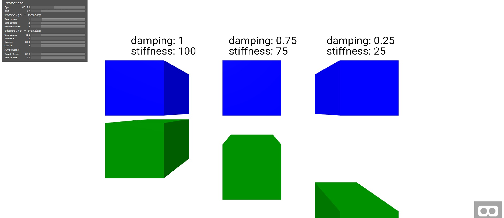

# aframe-physics-spring

[](https://www.npmjs.com/package/aframe-physics-spring)
<br />

Cannon.js spring class encapsulated in a AFRAME.component
## Requirements
[aframe physics system](https://github.com/donmccurdy/aframe-physics-system) <br>
[aframe](https://aframe.io/)

## Usage
```
<script src="https://cdn.rawgit.com/gftruj/aframe-physics-spring/master/dist/aframe-spring.min.js"></script>
....
<a-box id="one" static-body></a-box>
<a-box spring="target: #one"></box>
```
## Attributes
```
spring="target: #entity; restLength: 1; damping: 100; stiffness: 1"
```
**target** - the other end of the spring <br>
**restLength** - spring length when no forces applied <br>
**damping** - how much can it stretch <br>
**stiffness** - how much will it suppress the force <br>

## Example
[example](https://cdn.rawgit.com/gftruj/aframe-physics-spring/2a5971cd/example/spring.html) with different attributes
[glitch example](https://aframe-physics-spring.glitch.me/) with a timer changing the attributes over time and removing the component.
